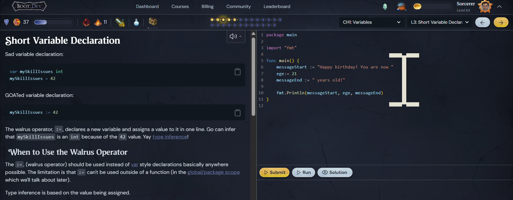
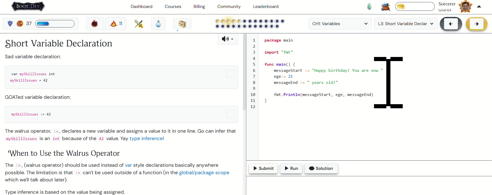

# boot-dev-light-mode-css

A "light-mode" CSS implementation designed to override the default dark theme of the [boot.dev](https://boot.dev) learning platform. This repository serves as a visual demonstration, showcasing a clear "before" (boot.dev's default dark mode) and "after" (applied light mode) scenario, highlighting how custom styles can dramatically transform a web application's appearance to suit personal preferences.

## 🚀 Getting Started

This section will guide you through applying this custom CSS to your boot.dev experience using a browser extension.

### Prerequisites

*   A web browser (Chrome, Firefox, Edge, Brave, etc.)
*   A browser extension capable of applying custom CSS to websites. **Stylus** is highly recommended for its ease of use and management.

### Installation

1.  **Install the Stylus browser extension:**
    If you don't already have it, install Stylus for your browser:
    *   Chrome Web Store (Stylus)
    *   Firefox Add-ons (Stylus)
    *   *(Search for "Stylus" in your browser's extension/add-on store if using a different browser).*

2.  **Copy the CSS Code:**
    Navigate to the `styles/boot-dev-light-mode.css` file in this repository. Click on the file, then click the "Raw" button to view the plain text. Copy the entire content of this CSS file.

3.  **Apply with Stylus extension:**
    *   Go to the [boot.dev](https://boot.dev) website in your browser.
    *   Click on the **Stylus icon** in your browser's toolbar (it usually looks like an 'S' or a pencil).
    *   Select the option "Write style for: boot.dev" or "Create new style for boot.dev".
    *   A new tab or window will open with the Stylus editor. Paste the copied CSS content into the editor.
    *   Ensure the "Applies to" section is correctly set for `URLs on the domain` `boot.dev`.
    *   Give your style a descriptive name (e.g., "Boot.dev Light Mode").
    *   Click the **Save** button (usually on the left side).

Once saved, the light mode theme should be immediately applied to boot.dev!

## ✨ Visual Demonstration

See the dramatic difference this light-mode CSS makes to the boot.dev platform.

### 🌑 Default Boot.dev (Unstyled)

This image shows the default dark theme of the boot.dev platform, as it appears before applying our custom light mode CSS.

### ☀️ Custom Light Mode (Styled)

This image illustrates the same boot.dev interface after applying the `boot-dev-light-mode.css` file, transforming it into a bright, easy-on-the-eyes light theme.

## 💡 How the Stylesheet Was Created (Prompting Files)

The `styles/boot-dev-light-mode.css` file was generated with the assistance of a large language model (LLM). The `prompts/` directory contains the specific input files and instructions (prompts) that were given to the LLM to generate the CSS. This includes:

*   **Initial requirements/goals:** Describing the desired light mode appearance.
*   **Contextual information:** Details about the boot.dev platform's structure or existing styles (if provided).
*   **Iterative refinements:** Subsequent prompts used to refine, debug, or expand upon the initial CSS output.

Exploring the `prompts/` directory can offer insight into the prompt engineering process used to achieve the current stylesheet.

## 🤝 Contributing

Contributions are welcome! If you have suggestions for improvements, new features (like more theming options), or bug fixes related to the light mode, please feel free to:

1.  Fork the repository.
2.  Create a new branch (`git checkout -b feature/your-feature-name`).
3.  Make your changes.
4.  Commit your changes (`git commit -m 'feat: Improve X styling'` or `fix: Fix Y element on Z page`).
5.  Push to the branch (`git push origin feature/your-feature-name`).
6.  Open a Pull Request.

## 📜 License

This project is licensed under the MIT License - see the [LICENSE](LICENSE) file for details.

---

**[⬆ Back to Top](#boot-dev-light-mode-css)**